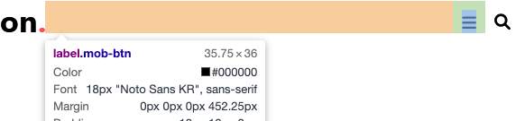
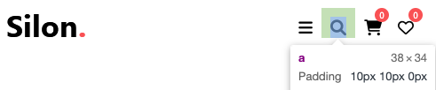

# 220530 TIL
# 1. 돔(DOM)이 뭐냐?
# 2. 브라우저 렌더링
# 3. 웹사이트 클론 작업

## 1. 돔(DOM)이 뭐냐?
  - 라고 물으면 'HTML(document)의 구조와 관계를 (object) 객체 형태로 표현한 모듈(model)이라고 하자. + (object) 객체는 아직 모른다. 모듈은 -> 방식 / 인터페이스 정도로 이해하자. 

  - DOM은 특정 언어에 종속되지 않는다. 자바스크립트를 통해 제어할 수 있는 대상이지만 자바스크립트 요소는 아니다. 
  - DOM은 가상 요소를 포함하지 않는다. ex)::before
  - DOM은 보이지 않는 요소도 포함한다. ex) display:none 등
    * 렌더 트리에선 제외

## 2. 브라우저 렌더링

### 렌더링 과정(Critical Rendering Path)
  1. Parsing
    - html,css 파일을 파싱해서 Object Model 생성. (Object Model : 각각 DOM Tree, CSSOM 트리)
  2. Style      
    - DOM 트리와 CSSOM 트리를 결합해 Rendering Tree를 생성.
    - * Rendering Tree에는 실제 화면에 표현되는 요소들로만 구성. (display:none 속성이 설정된 요소는 제외)
    - * JavaScript를 만나면? HTML파서는 JS 코드를 실행하기 위해 파싱 중단.
  3. Layout
    - 각 요소들이 브라우저 화면(Viewport)의 어떤위치에 어떤크기로 출력될지 계산
  4. Paint
    - Layout 단계에서 계산된 값을 이용해 Render Tree의 각 요소를 실제 픽셀로 변환.
    - 변환된 결과는 하나의 레이어가 아닌 여러개의 레이어로 관리.
  5. Composite
    - Paint 단계에서 생성된 레이어를 합성하여 실제 화면에 나타냄.

## 3. 웹사이트 클론 작업(헤더)
- 1. flex 요소 정렬 방법 1  
      #한쪽 마진 : auto, 반대편 마진 : '숫자'
      #-> 반대편에서 '숫자'만큼 떨어짐 (포지션 속성과 유사)
      
  - 2. flex 요소 정렬 방법 2      
      #요소의 클릭영역을 넓혀주기 위해 부여한 padding값을 조정
      #해당 실습에서는 padding-bottom만 0을 줘서 왼쪽 로고와 수평이 되도록 했다.
      
  - 3. css 드랍다운      
      #라벨을 클릭했을 때 높이가 0에서 365px으로 늘어나게 구현.
      #높이를 지정하지 않고 애니메이션 효과를 줄 수 있는 방법은 없을까?

  - 4. data- 속성 활용